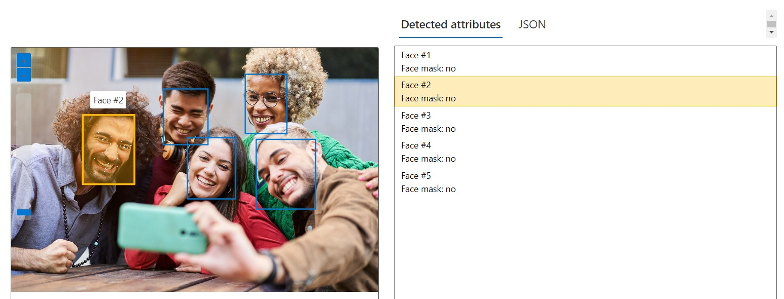
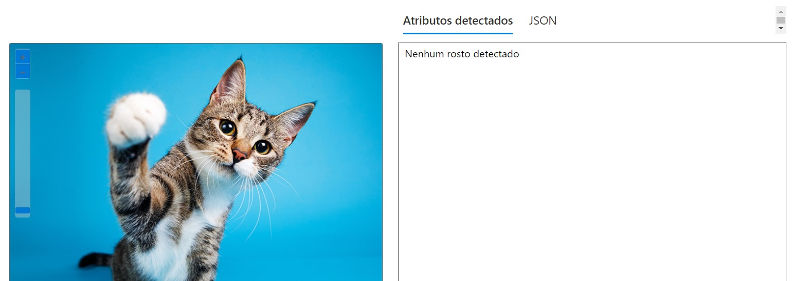
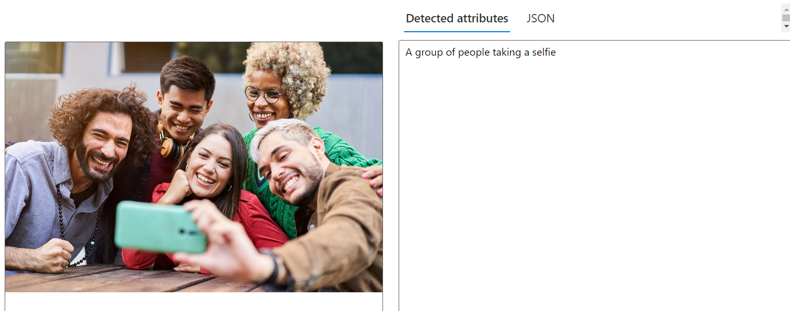
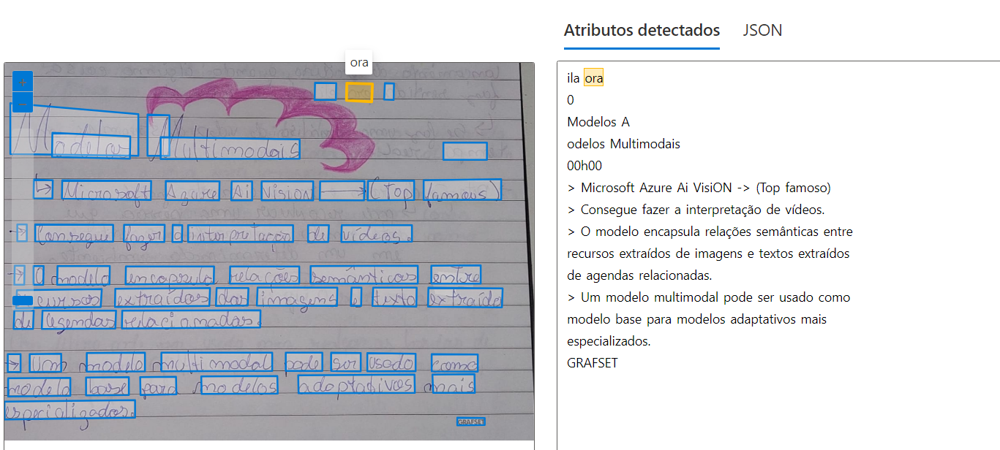

# Projeto-visionStudio-DIO
Durante as aulas aprendi muita coisa a respeita de IA no geral e nessas aulas especializadas em **visão computacional** entendi como a maquina lê uma imagem.

Aqui trouxe alguns exemplos que presenciei usando o [Vision Studio](https://portal.vision.cognitive.azure.com/gallery/featured).

### Reconhecimento Facial

O reconhecimento facial pode ser usado em diversas áreas do nosso dia a dia, como reconhecimento de pessoas não permitidas em ambientes, reconhecimento de funcionários, reconhecimento facial como chave para liberação de algo etc. Nesse exemplo perceba que o codigo foi capaz de identificar cada uma dos 5 rostos perfeitamente. O programa também pode descrever onde está cada caracteristica do rosto das pessoas como boca, olhos, sobrancelhas etc. Você pode ver isso no arquivo txt que deixei separado em outputs. 

Nesse exemplo quis testar e confirmar que esse código só reconhece rosto Humano.

### Criando legendas descritivas

Pude ver nas aulas que uma das funcionalidades da ia pode ser a descrição de imagens. Isso pode ser aplicada de uma forma inclusiva ou apenas focana em outro objetivo. Focando na inclusão, atravez desse tipo de tarefa pode se ter a descrição de imagens para pessoas que possuem alguma deficiencia visual ou dificuldade de interpretação naquela imagem. Permitindo mais acessibilidade nos aplicativos de redes sociais, de saúde, comercial ou qualquer área que envolva interpretação de imagens. Dependendo do nivel de especialização dessa IA ela pode chegar a descrever muito mais recursos sobre a imagem.

### Extraindo texto de Imagens

Imagine que você trabalha numa empresa que contem 80% da sua documentação em forma física, ou seja, papeis impressos ou escritos à mão. Esse tipo de documento pode ser perdido ou destruido de diversas formas. Através da extração de texto de imagens você pode acelerar a trasição de documentação física para virtual além de trabalhar em cima de outras dificuldades como documentos ilegiveis. A respeito de documentos escritos à mão, a IA não trabalha de forma 100% efetiva pois pode depender da caligrafia do autor ou qualidade da imagem. Nessa imagem por exemplo, escrita por mim, há exemplo de alguns erros. Veja que algumas das minhas letras foram confudidas como quando o programa leu "0". A iluminação no caso fez a ia erroneamente ler um texto escrito atrás da página. 

Quando se trata de recuperação de dados de documentos físicos, uma IA especializada nisso pode ajudar muito. Nessa imagem trago apenas o exemplo de extração de texto e a demostração de como a caligrafia e condições da imagem podem afetar a leitura da IA.
